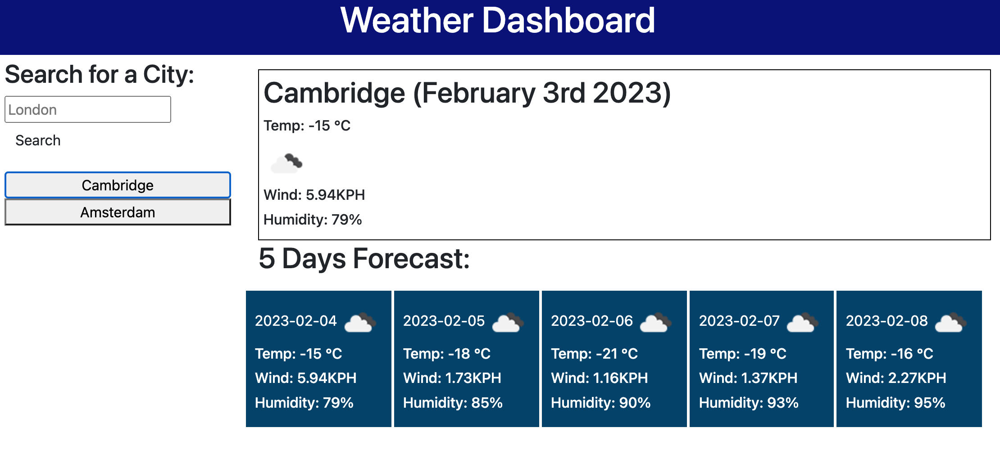

# Weather Dashboard

## Description

This weather forecast dashboard is challenge 8 of the Front-End Web Developer bootcamp. 
To build this programme, I have used the [5 Day Weather Forecast](https://openweathermap.org/forecast5) API to retrieve weather data for cities. 

Here is how the programme works:

  * When a user searches the current weather conditions for a city, they are presented with the below for the current day and next 5 days:
    * The city name
    * The date
    * An icon representation of weather conditions
    * The temperature
    * The humidity
    * The wind speed
  * When a user click on a city in the search history they are again presented with current and future conditions for that city

The following image shows the web application's appearance and functionality and the live programme can be found [here](https://helenesauve.github.io/weather-dashboard/)

